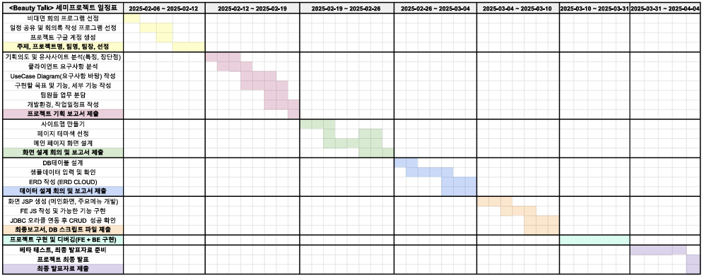
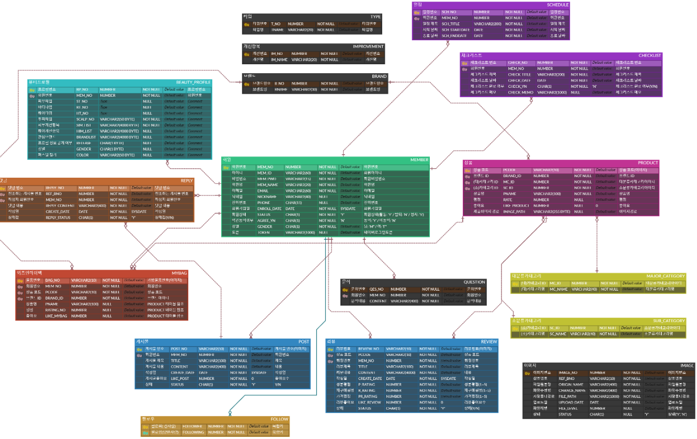
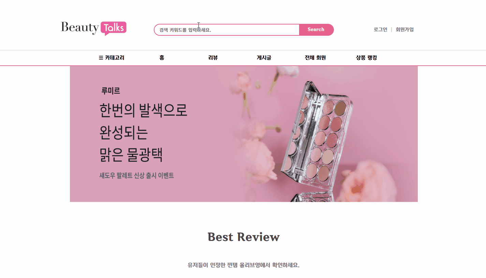
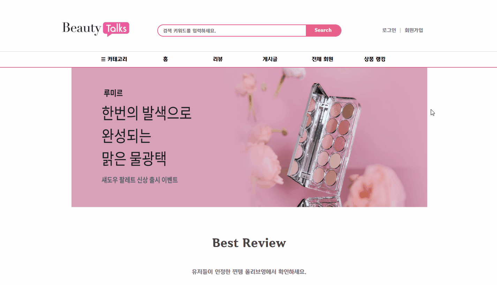
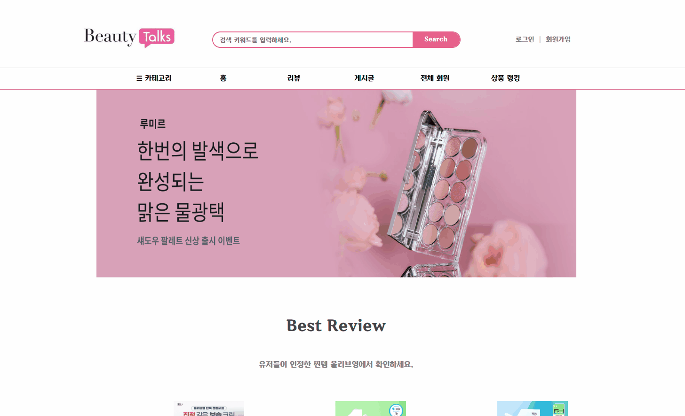
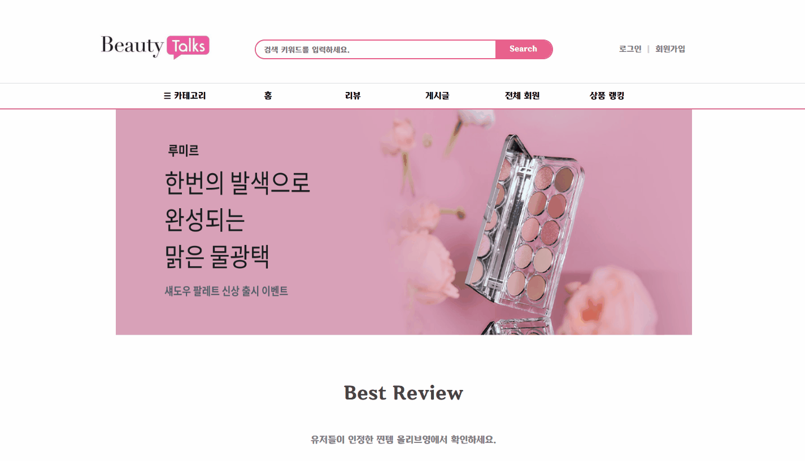
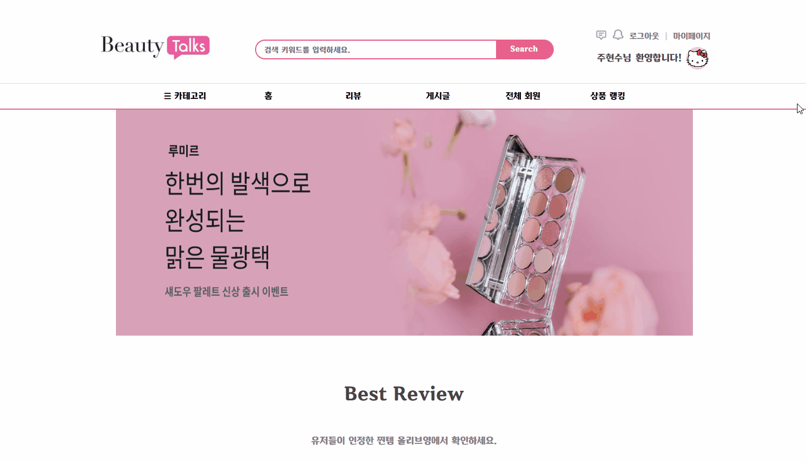

# 🌸 프로젝트 소개
오늘날에는 올리브영과 같은 H&B(헬스앤뷰티) 스토어와 온라인 쇼핑몰 덕분에   
누구나 손쉽게 다양한 화장품을 접할 수 있습니다.  
하지만 선택의 폭이 넓어진 만큼, **어떤 제품이 자신에게 맞는지 고민하는 소비자들**도 많아졌습니다.  
현대의 소비자들은 **정보 공유를 통해 자신에게 최적화된 제품을 찾고자** 하며,  
이에 따라 **SNS 기능을 결합한 뷰티 커뮤니티 플랫폼**의 필요성이 대두되고 있습니다.  

본 프로젝트는 이러한 니즈를 반영하여 다음과 같은 기능을 제공합니다:  
✔ **사용자 리뷰와 SNS 기능(팔로우, 좋아요 등)을** 통해 제품에 대한 신뢰 형성  
✔ **화장품 사용 가이드 및 메이크업 영상을 제공**하여 초보자도 쉽게 따라할 수 있도록 지원  

누구나 쉽고 간편하게 화장품을 접하고, 자신에게 맞는 뷰티 루틴을 찾아갈 수 있는 공간을 제공하는 것이 본 프로젝트의 목표입니다.
   

# 📆 개발 기간
#### 2025.02.06 ~ 2025.04.04
* 2025.02.06 ~ 2025.02.12 : 주제 선정, 팀장 선출, 진행 방향 논의
* 2025.02.12 ~ 2025.02.19 : 기획 의도, 유사사이트 분석, 클라이언트 요구사항 분석, UseCase Diagram 작성, 구현 목표 및 세부 기능, 작업 일정표
* 2025.02.19 ~ 2025.02.26 : 사이트맵, Visily툴을 활용한 화면 설계
* 2025.02.26 ~ 2025.03.04 : DB 테이블 설계, 샘플데이터, ERD CLOUD를 활용한 ERD 작성
* 2025.03.04 ~ 2025.03.10 : 화면 JSP 생성, 주요기능 구현, JDBC 오라클 연동 후 CRUD 테스트
* 2025.03.10 ~ 2025.03.31 : 프로젝트 구현 및 디버깅
* 2025.03.31 ~ 2025.04.03 : 베타 테스트, 최종 발표자료 준비
* 2025.04.04 : 프로젝트 최종 발표  

   

# 👨‍💻 구성원 및 역할
### ❤️ 전창용 (조장)  
<!-- 여기에 입력하심댑니다 -->
 

### 💛 주현수 (조원)
- 일반회원 로그인
- 카카오톡 API 로그인
- ID/PW 찾기 (이메일 인증)
- 로그아웃
- 뷰티캘린더 일정 조회/추가/삭제
- 팔로잉 뷰티캘린더 조회
- 투두리스트 루틴 설정
- 투두리스트 조회/추가/완료/삭제
- 인기 유저 조회
- 유저 팔로우/언팔로우
 

### 💜 이용훈 (조원)
<!-- 여기에 입력하심댑니다 -->

   

# ⚙️ 개발 환경
* OS : Windows10
* IDE : Eclipse / VS Code / SqlDeveloper
* Server : Apach Tomcat 9.0
* DBMS : Oracle
* Languages : Java, HTML, CSS, JavaScript, JQuery, JSP, SQL
* Management : Git, GitHub, SourceTree
   

# 🛠️ 기술 스택 & 사용 라이브러리
### 🖥️ Front-End
* HTML5, CSS3, JavaScript  
* jQuery, AJAX, JSON
* FullCalendar.js (캘린더 UI 라이브러리)

### ⚙️ Back-End
* Java 11
* JSP & Servlet
* Oracle DB (JDBC: ojdbc6 사용)  

### 🌐 API / 외부 연동
* 네이버 로그인 API (OAuth 기반 소셜 로그인)
* 카카오 로그인 API (OAuth 기반 소셜 로그인)
* Google 이메일 인증 (JavaMail API 사용)

### 📦 주요 기능별 사용 라이브러리
* 🔐 소셜 로그인: 네이버, 카카오 API
* 📧 이메일 인증: JavaMail API, Activation
* 📂 파일 업로드: commons-fileupload, cos.jar
* 🔄 JSON 처리: Gson, JSON-simple
* 🗄 DB 연동: Oracle JDBC Driver (ojdbc6)
   

# 💾 설계
ERD CLOUD:  

   

# 🎀 프로젝트 구현
### ❤️ 전창용  

### 💛 주현수  
- 일반회원 로그인
  

- 아이디 저장
  

- 카카오톡 API 로그인
  

- 아이디 찾기
  

- 비밀번호 찾기 및 변경
  

- 로그아웃
  

- 뷰티캘린더 일정 조회
  

- 뷰티캘린더 일정 추가
  

- 뷰티캘린더 일정 삭제
  

- 팔로잉 뷰티캘린더 조회(조회만 가능, 삭제 불가)
  

- 팔로잉 투두리스트 조회(조회만 가능, 루틴 추가 불가)
  

- 투두리스트 추가
  

- 투두리스트 루틴 설정
  

- 투두리스트 완료
  

- 투두리스트 삭제
  

- 전체보기 / 미완료 / 완료 / 전체삭제
  

- 인기 유저 조회
  

- 비로그인 시 로그인 창으로 리로딩
  

- 유저 팔로우/언팔로우
  

### 💜 이용훈  

   

# 📚 최종 보고서
