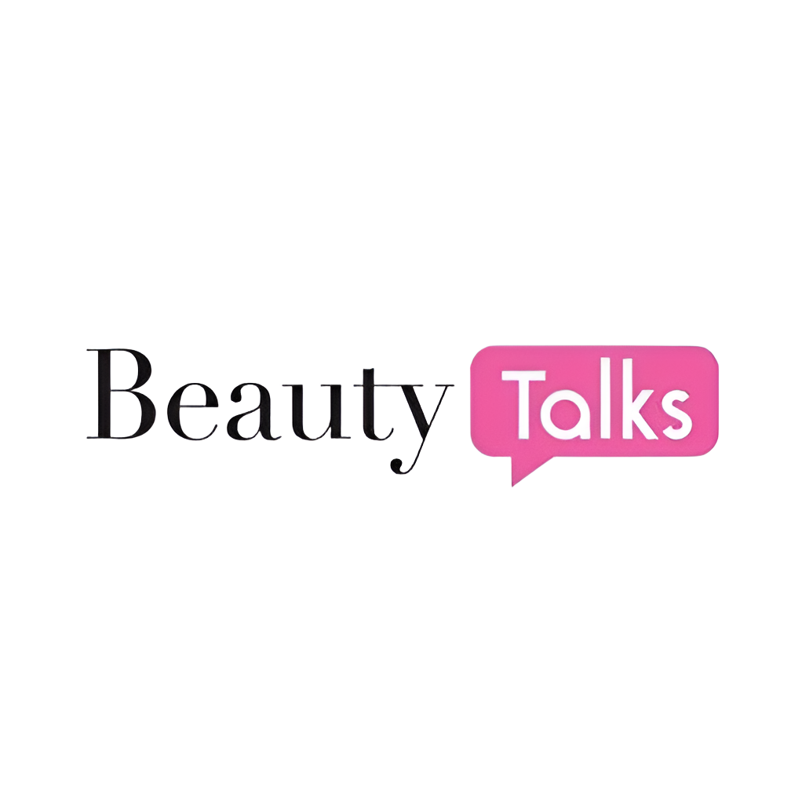

# 🌸 프로젝트 소개
오늘날에는 올리브영과 같은 H&B(헬스앤뷰티) 스토어와 온라인 쇼핑몰 덕분에 누구나 손쉽게 다양한 화장품을 접할 수 있습니다.
하지만 선택의 폭이 넓어진 만큼, **어떤 제품이 자신에게 맞는지 고민하는 소비자들**도 많아졌습니다.
현대의 소비자들은 **정보 공유를 통해 자신에게 최적화된 제품을 찾고자** 하며, 
이에 따라 **SNS 기능을 결합한 뷰티 커뮤니티 플랫폼**의 필요성이 대두되고 있습니다.
본 프로젝트는 이러한 니즈를 반영하여 다음과 같은 기능을 제공합니다:
✔ **사용자 리뷰와 SNS 기능(팔로우, 좋아요 등)**을 통해 제품에 대한 신뢰 형성
✔ **화장품 사용 가이드 및 메이크업 영상을 제공**하여 초보자도 쉽게 따라할 수 있도록 지원
누구나 쉽고 간편하게 화장품을 접하고, 자신에게 맞는 뷰티 루틴을 찾아갈 수 있는 공간을 제공하는 것이 본 플랫폼의 목표입니다.

# 📆 개발 기간

# 👨‍💻 구성원 및 역할

# ⚙ 개발 환경

# 🛠️ 기술 스택 & 사용 라이브러리

# 💾 설계

# 🎀 프로젝트 구현
### ❤ 전창용
### 💛 주현수
### 💜 이용훈

# 📚 최종 보고서
